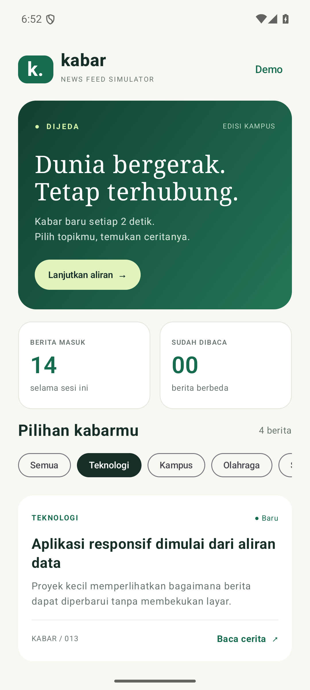
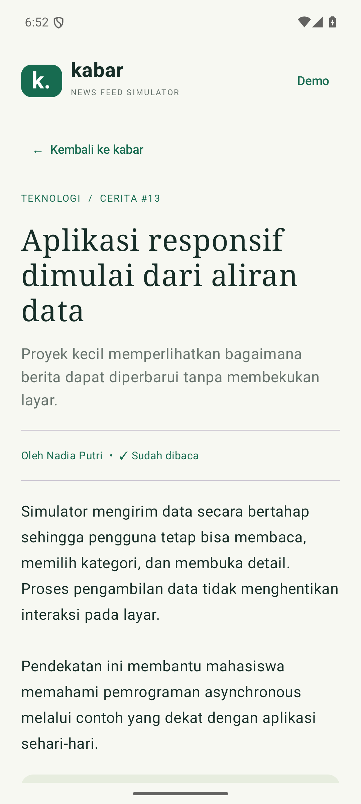
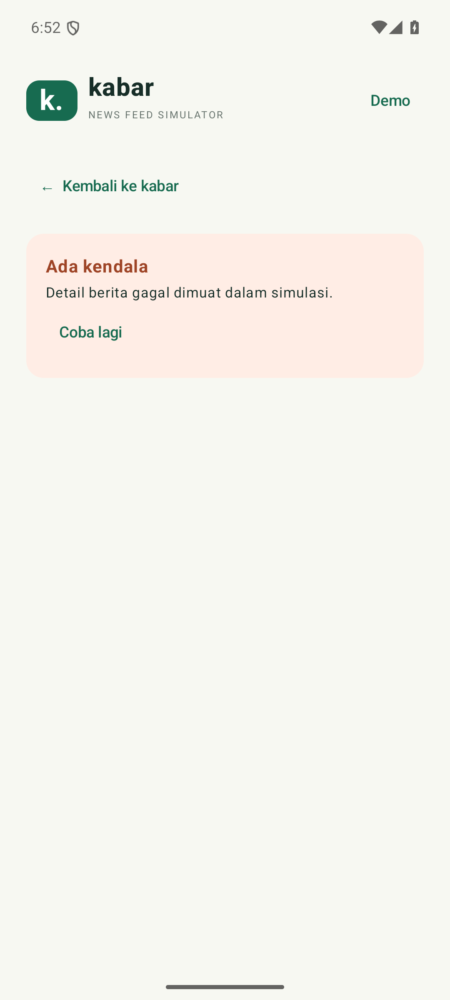

# News Feed Simulator

Aplikasi Android Kotlin untuk **Tugas Praktikum Pertemuan 2: Advanced Kotlin, Coroutines, dan Flow**, IF25-22017 Pengembangan Aplikasi Mobile, ITERA.

Berita fiktif diterbitkan setiap **2 detik**. Pengguna dapat memilih kategori, membaca detail, menjeda aliran, dan melihat jumlah berita berbeda yang sudah dibaca. Aplikasi bekerja offline, tanpa API key atau izin internet.

| Daftar dan filter | Detail berita | Pemulihan error |
| --- | --- | --- |
|  |  |  |

## Identitas

- Nama: **Ray Regan Sitepu**
- NIM: **1233140047**
- Kelas: **RA**

## Menjalankan di Android Studio

1. Buka folder proyek ini melalui **File → Open**.
2. Gunakan Android Studio yang mendukung Android Gradle Plugin 9.1.1 (Panda 3 atau lebih baru), serta **Gradle JDK 17 atau lebih baru**. Proyek ini dibangun menggunakan JDK 25.
3. Melalui SDK Manager, instal **Android SDK Platform 37.0** dan **Build-Tools 36.0.0**. Tunggu Gradle Sync selesai. Internet hanya diperlukan untuk mengunduh alat/dependency saat build pertama.
4. Android Studio akan membuat `local.properties` sesuai lokasi SDK. Jika berkas ini berasal dari komputer lain, sesuaikan `sdk.dir` atau hapus berkas tersebut lalu sync ulang.
5. Pilih emulator atau perangkat Android **8.0 / API 26 ke atas**, pilih konfigurasi `app`, kemudian tekan **Run**.

### Melalui terminal

Windows PowerShell, dari folder proyek:

```powershell
.\gradlew.bat :app:assembleDebug
.\gradlew.bat :app:testDebugUnitTest
.\gradlew.bat :app:lintDebug
```

macOS/Linux:

```sh
chmod +x gradlew
./gradlew :app:assembleDebug :app:testDebugUnitTest :app:lintDebug
```

APK hasil build: `app/build/outputs/apk/debug/app-debug.apk`.

Dengan perangkat/emulator yang sudah terhubung:

```powershell
.\gradlew.bat :app:installDebug
```

Laporan unit test: `app/build/reports/tests/testDebugUnitTest/index.html`.

## Cara menggunakan

1. Buka aplikasi. Berita pertama muncul setelah 2 detik, berikutnya setiap 2 detik.
2. Geser pilihan kategori untuk memilih **Semua**, **Teknologi**, **Kampus**, **Olahraga**, atau **Sains**.
3. Tekan kartu berita. Indikator loading muncul saat isi berita dan penulis diambil bersamaan.
4. Setelah detail berhasil dimuat, berita ditandai **Dibaca** dan penghitung bertambah. Membaca berita yang sama lagi tidak menambah penghitung.
5. Tekan **Kembali ke kabar** atau tombol Back perangkat untuk kembali ke daftar.
6. Tekan **Jeda aliran** / **Lanjutkan aliran** untuk mengendalikan simulasi.
7. Menu **Demo** menyediakan dua simulasi error. Error aliran terjadi pada kiriman berikutnya; error detail terjadi pada pemuatan detail berikutnya. Gunakan **Coba lagi** untuk memulihkan.

## Pemetaan ketentuan dan rubrik PDF

| Ketentuan | Implementasi | Lokasi |
| --- | --- | --- |
| Flow mengirim berita setiap 2 detik | `flow`, `delay(2_000)`, `emit`, `collect`; ID unik per kiriman | `data/NewsRepository.kt`, `domain/NewsFeedStore.kt` |
| Filter kategori | Flow dari history diproses menggunakan `filter`; pilihan kategori menjadi StateFlow | `domain/NewsFeedStore.kt` |
| Transformasi format tampilan | `map` menjadi `NewsCard`, extension `toDisplayText` merapikan spasi dan membatasi ringkasan | `data/News.kt`, `domain/NewsFeedStore.kt` |
| Operator `onEach` | Menghitung berita yang diterima tanpa mengubah objek berita | `domain/NewsFeedStore.kt` |
| StateFlow jumlah berita dibaca | `MutableStateFlow<Int>` privat diekspos sebagai `StateFlow<Int>`; ID mencegah hitungan ganda | `domain/NewsFeedStore.kt` |
| Detail asynchronous | `coroutineScope`, dua `async`, `await`, `Dispatchers.IO` yang dapat diinjeksi | `domain/NewsFeedStore.kt`, `data/NewsRepository.kt` |
| Error handling | `.catch` untuk feed; `try/catch` untuk detail; cancellation diteruskan | `domain/NewsFeedStore.kt` |
| Bonus unit test | 12 tes menggunakan JUnit dan `kotlinx-coroutines-test` | `app/src/test/kotlin/id/ac/itera/newsfeed/NewsFeedTest.kt` |

Seluruh path kode utama relatif terhadap `app/src/main/kotlin/id/ac/itera/newsfeed/`.

## Alur data dan konsep

```text
SimulatedNewsRepository
  flow { delay(2000); emit(news) } + flowOn(IO)
                 |
                 v
NewsFeedStore: onEach -> catch -> collect -> history (100 terbaru)
                 |
                 v
combine(history, kategori, ID dibaca)
  -> asFlow -> filter -> map -> toList -> StateFlow kartu
                 |
                 v
Jetpack Compose: collectAsStateWithLifecycle -> tampilan

Buka kartu -> coroutineScope
               |-- async: fetchBody   (900 ms)
               |-- async: fetchAuthor (600 ms)
             -> await keduanya (~900 ms)
             -> tandai ID dibaca -> StateFlow jumlah dibaca
```

- **Cold Flow:** sumber berita hanya bekerja ketika dikoleksi.
- **StateFlow:** menyimpan state terbaru dan memperbarui UI ketika nilainya berubah.
- **Structured concurrency:** coroutine menggunakan `viewModelScope`; kedua pengambilan detail merupakan child dari scope yang sama. Jika salah satu gagal, sibling dibatalkan.
- **Dispatcher:** simulasi repository menggunakan `Dispatchers.IO`; state dan UI dikelola dari scope ViewModel. `delay` menangguhkan coroutine tanpa memblokir thread.
- **Lifecycle:** feed dijeda ketika layar aplikasi tidak aktif dan dilanjutkan saat kembali, kecuali pengguna menjeda sendiri atau feed sedang error. Pergantian konfigurasi mempertahankan ViewModel. Menutup detail membatalkan pengambilan yang belum selesai.
- **Advanced Kotlin:** data class, enum, sealed interface, extension function, lambda, nullable category (`null` berarti semua), dan higher-order operators.

## Pengujian

Tes memakai `runTest` dan `StandardTestDispatcher` agar penundaan diuji dengan waktu virtual, bukan menunggu waktu nyata.

1. Cold Flow dan interval 2 detik.
2. Pencegahan collector ganda, jeda, dan lanjut dengan ID unik.
3. Pergantian kategori pada history yang sudah ada.
4. Filter pada berita yang baru datang.
5. Pengambilan detail paralel selesai dalam 900 ms virtual dan tidak menghitung bacaan yang sama dua kali.
6. Pembacaan berita berbeda menambah penghitung.
7. Detail gagal tidak dihitung dan dapat dicoba kembali.
8. Menutup detail saat loading membatalkan operasi.
9. Membuka detail lain membatalkan hasil lama.
10. Error feed mempertahankan history dan dapat dipulihkan.
11. History dibatasi 100 berita terbaru, total masuk tetap akurat.
12. Transformasi teks merapikan spasi dan membatasi panjang ringkasan.

### Skenario demonstrasi singkat

- Tunggu 8 detik: empat kategori sudah menerima berita.
- Pilih Teknologi, lalu kembali ke Semua: history tampil tanpa restart feed.
- Buka satu berita: loading lalu penghitung menjadi 1.
- Buka berita yang sama lagi: penghitung tetap 1.
- Jeda: jumlah berita masuk berhenti bertambah.
- Lanjutkan, buka Demo → gagalkan kiriman berikutnya → Coba lagi.
- Demo → gagalkan detail berikutnya → buka kartu → Coba lagi.

## Batasan yang disengaja

- Ini proyek **Android Kotlin dengan Jetpack Compose**, bukan proyek iOS atau Kotlin Multiplatform. PDF tugas meminta proyek Kotlin; target Android dipilih agar hasil praktikum dapat dipakai sebagai aplikasi mobile.
- Semua berita dan nama penulis fiktif. Delapan contoh berita diulang dengan ID baru untuk mensimulasikan berita baru tanpa batas.
- History menampung 100 berita terbaru. Total berita masuk dan jumlah dibaca berlaku selama sesi ViewModel; data direset ketika proses aplikasi ditutup. Tidak ada database.
- Tampilan memakai tema terang dan teks bahasa Indonesia.

## Pengumpulan

Lengkapi identitas, upload kode proyek ke repository GitHub, lalu submit link repository di LMS. Sertakan Gradle Wrapper dan README. Jangan upload `local.properties`, `.gradle`, atau folder `build`. Berdasarkan PDF: deadline **Pertemuan 3**, bobot **4% nilai akhir**. Upload GitHub dan pengiriman LMS dilakukan oleh pemilik akun.

## Referensi

- [Kotlin Coroutines Guide](https://kotlinlang.org/docs/coroutines-guide.html)
- [Kotlin Flow](https://kotlinlang.org/docs/flow.html)
- [Kotlin Coroutines Test](https://kotlinlang.org/api/kotlinx.coroutines/kotlinx-coroutines-test/)
- [Android Gradle Plugin 9.1.1 dan kompatibilitas SDK](https://developer.android.com/build/releases/agp-9-1-0-release-notes)
- Materi kuliah `P2 - Advanced Kotlin Coroutines Flow.pdf`, halaman 32–33.
